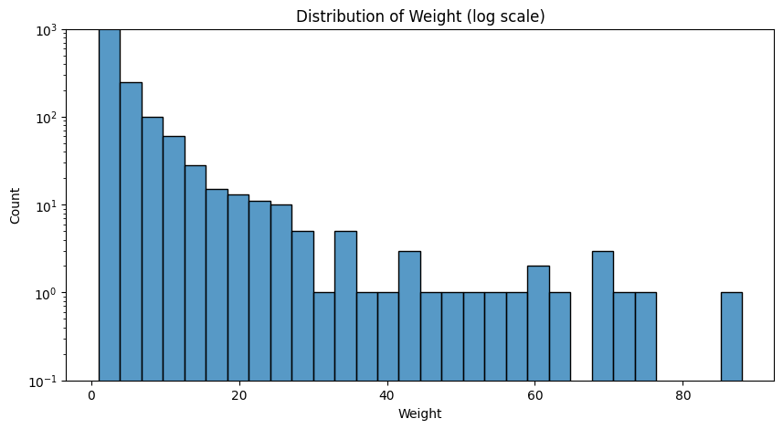
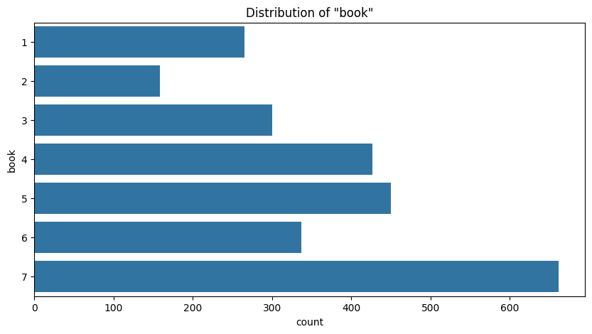
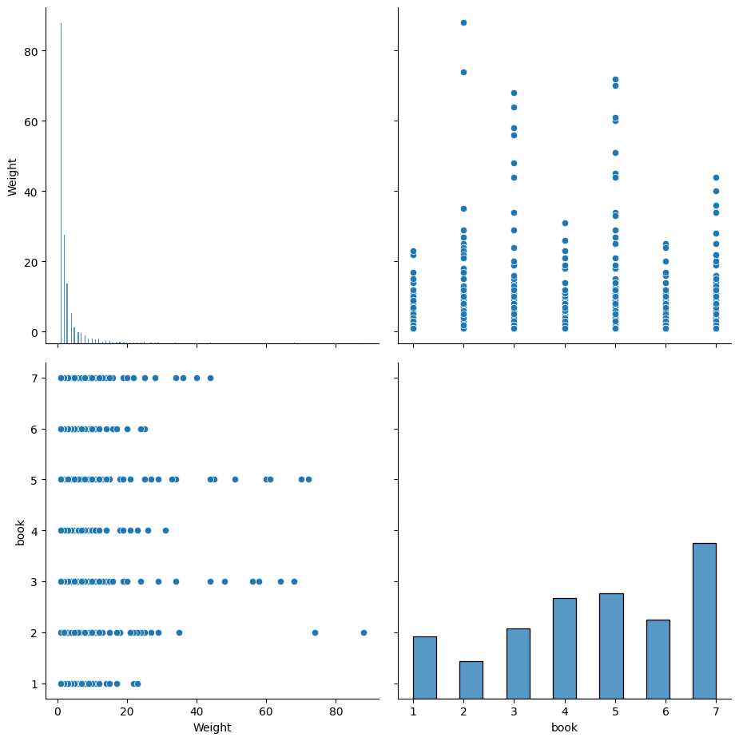

# Testing Information Extraction Capabilities of Cleora Embeddings

## Overview
This project explores the use of Cleora embeddings for tasks involving graph-based feature representation and classification. 


<!-- Cleora embeddings are derived from graph structures to effectively encode relationships between entities. By combining these embeddings with standard machine learning techniques, we aim to extract meaningful patterns and evaluate their classification performance. -->


## Exploratory Data Analysis

Dataset Source: [Kaggle: Witcher Network](https://www.kaggle.com/datasets/avasadasivan/witcher-network)

As the first step, we conduct an exploratory analysis of the Witcher network dataset to understand the underlying structure and characteristics of the interactions among characters. The analysis includes visualizations and descriptive statistics to provide insights into the network's properties.

The dataset contains **4 columns**:
- `Source`: Name of one interacting character.
- `Target`: Name of the other interacting character.
- `Weight`: Number of interactions between the characters.
- `book`: The book in which the interaction took place.

### Sample Dataset
Below is a small excerpt from the dataset:

|   | Source   | Target   | Type        | Weight | Book |
|---|----------|----------|-------------|--------|------|
| 0 | Velerad  | Geralt   | Undirected  | 1      | 1    |
| 1 | Geralt   | Foltest  | Undirected  | 5      | 1    |
| 2 | Foltest  | Geralt   | Undirected  | 4      | 1    |
| 3 | Adda     | Geralt   | Undirected  | 1      | 1    |
| 4 | Geralt   | Ostrit   | Undirected  | 4      | 1    |

### Key Objective
For this experiment, we aim to **classify interactions** by predicting the book they belong to. 
- **Features**: `Source` and `Target`
- **Target Variable**: `book`
- **Edge Weight**: Interaction frequency (`Weight`)

---

### Dataset Summary
Here are the basic statistics for the dataset:

| Statistic   | Weight     | Book       |
|-------------|------------|------------|
| **Count**   | 2600.0     | 2600.0     |
| **Mean**    | 3.28       | 4.65       |
| **Std Dev** | 6.24       | 1.96       |
| **Min**     | 1.0        | 1.0        |
| **25%**     | 1.0        | 3.0        |
| **50%**     | 1.0        | 5.0        |
| **75%**     | 3.0        | 7.0        |
| **Max**     | 88.0       | 7.0        |


<!-- 



 -->

<h2 align="center">Weights Distribution</h2>
<p align="center">
  
</p>

<h2 align="center">Book Distribution</h2>
<p align="center">
  
</p>

<h2 align="center">Pairplot</h2>
<p align="center">
  
</p>

<h2 align="center">Interactive Network Graph Visualization</h2>


<div align="center">
  <p>
    Additionally, you can view the interactive visualization of the network graph 
    <a href="images/network_graph.html">here</a>.
  </p>
</div>


## Experiments


## Results


## Technical Details

### Requirements
To replicate the results or extend the analysis, the following tools and libraries are required:
- Python 3.x
- Pandas
- NumPy
- Scikit-learn
- Matplotlib
- Seaborn

### Calculating embeddings

```sh
.\cleora.exe --input "D:\Uni\cleora-social-network\data\witcher_processed.tsv" -o
 output -c "Source Target Weight" --dimension 64 -n 5
```


